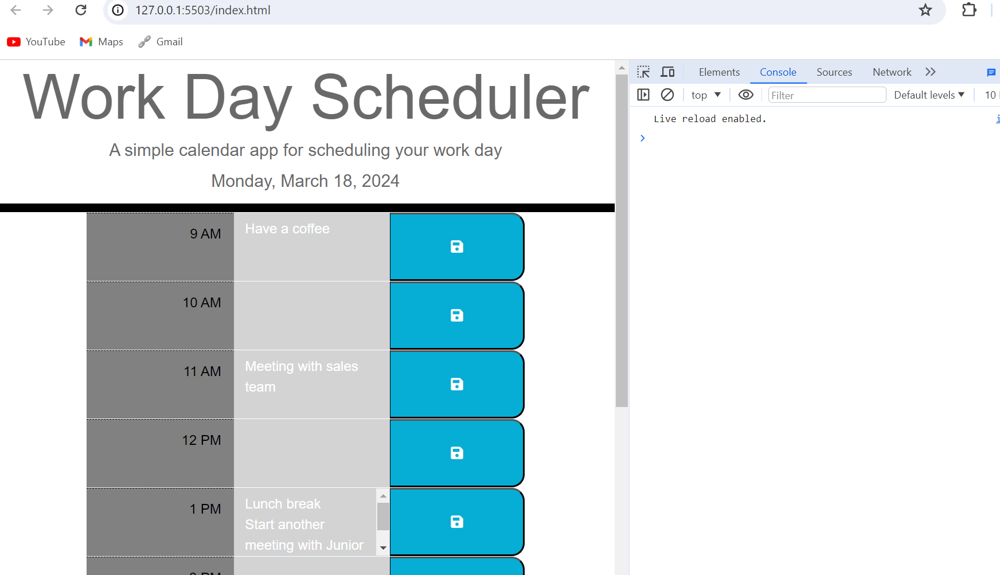

# Work-Day-Scheduler-Challenge
The purpose is  to create a calendar application that allows a user to save events for each hour of the day. This application is dynamically updated using HTML and CSS powered by jQuery and Day.js for date and time.

## Table of Contents

-Block of one hour to save events
-Time slot for standard business hours
-Save icon
-Current date

## Features

-Easy usage
-Ability to save and erase
-Coloured time-block
-Ability to save multiple activities under one time-block

## Screenshot of the results

## Link to page

## Link to repo

https://github.com/AOD4141/Workday-scheduler

## Authors

- [GitHub - Adebayo Dada](https://github.com/AOD4141)

## License

- This application is covered under: [MIT License](https://choosealicense.com/licenses/mit)
